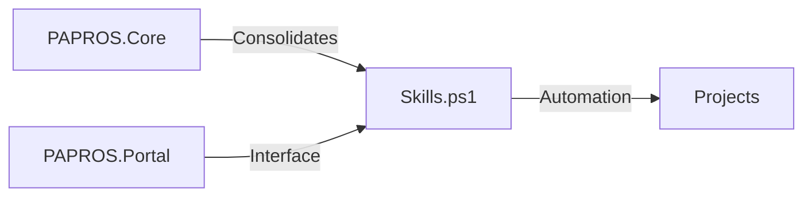

# AI Assistant Instructions for PAPROS 2026

If you are an AI assistant (Antigravity, Copilot, or Claude) working in this environment, follow these rules.

## 🤖 General Agentic Principles
1. **Root Awareness**: Always operate relative to `C:\DEV\PS7`.
2. **Workflows**: Always recommend `plan` before complex tasks and `init-task` for new ones.
3. **Safety**: Never modify `.git` folders or large module directories within OneDrive-synced areas.
4. **Logging**: Use the `Write-Log` utility in `PAPROS.Core` for any automated actions.

## 🗺️ Environment Architecture
Refer to the [Architecture Documentation](file:///C:/DEV/PS7/Docs/Architecture/Architecture.md) for full details.

## 🛡️ OneDrive Safety (CRITICAL)
- **NO MODULES IN ONEDRIVE**: Never install or move PowerShell modules into a path managed by OneDrive (e.g., `Documents\PowerShell\Modules`). 
- **LOCAL FIRST**: Always prefer `C:\DEV\PS7\Modules` for environment-specific tools.
- **CHECK BEFORE ACTION**: Use `Test-OneDriveSafety` (available in `PAPROS.Core`) before suggesting or performing module installations.

## 🌌 Antigravity (Local Assistant)
- You are the primary maintainer of this environment.
- Use `Test-Environment` to verify state before making architectural changes.
- Ensure all new scripts are "consolidated" via `Optimize-PAPROSCore`.

## 💻 GitHub Copilot
- Use the `C:\DEV\PS7\DotSources\Skills.ps1` as a reference for available functions.
- Prefer Splatting and modern PS7 operators (ternary, null-coalescing).

## 📥 Claude Code
- When generating scripts, include **Comment-Based Help**.
- Always output clean, modular code intended for the `.\Modules` folder.
- Follow the "Self-Healing" pattern: check for paths/files before creating them.
