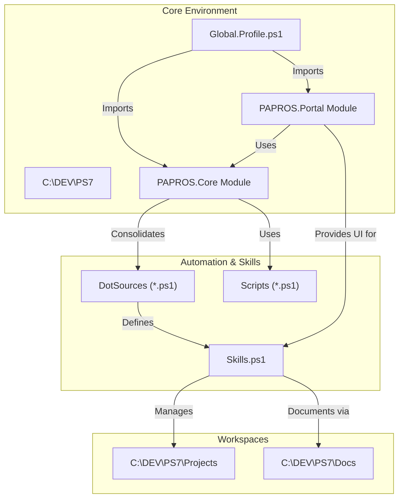

# PAPROS 2026 Architecture

This document describes the relationship between the core components of the PAPROS Agentic Workstation.

## 🗺️ System Overview (UML)

## 🛠️ Components

| Component | Description | Primary File |
| :--- | :--- | :--- |
| **Core** | Heart of the system; handles logging and self-healing consolidation. | `PAPROS.Core.psm1` |
| **Portal** | Interactive UI for the workstation. | `PAPROS.Portal.psm1` |
| **Skills** | Actionable PowerShell functions for tasks/projects. | `DotSources\Skills.ps1` |
| **Scripts** | One-off maintenance and utility tools. | `Scripts\CheckHealth.ps1` |
| **Docs** | Knowledge base and AI instructions. | `Docs\AI_Instructions.md` |

## 🛡️ Safety Protocols
- **OneDrive Isolation**: Core modules and active projects must reside outside of OneDrive-synced paths to prevent latency and sync conflicts.
- **Root Awareness**: All operations are relative to the environment root.
