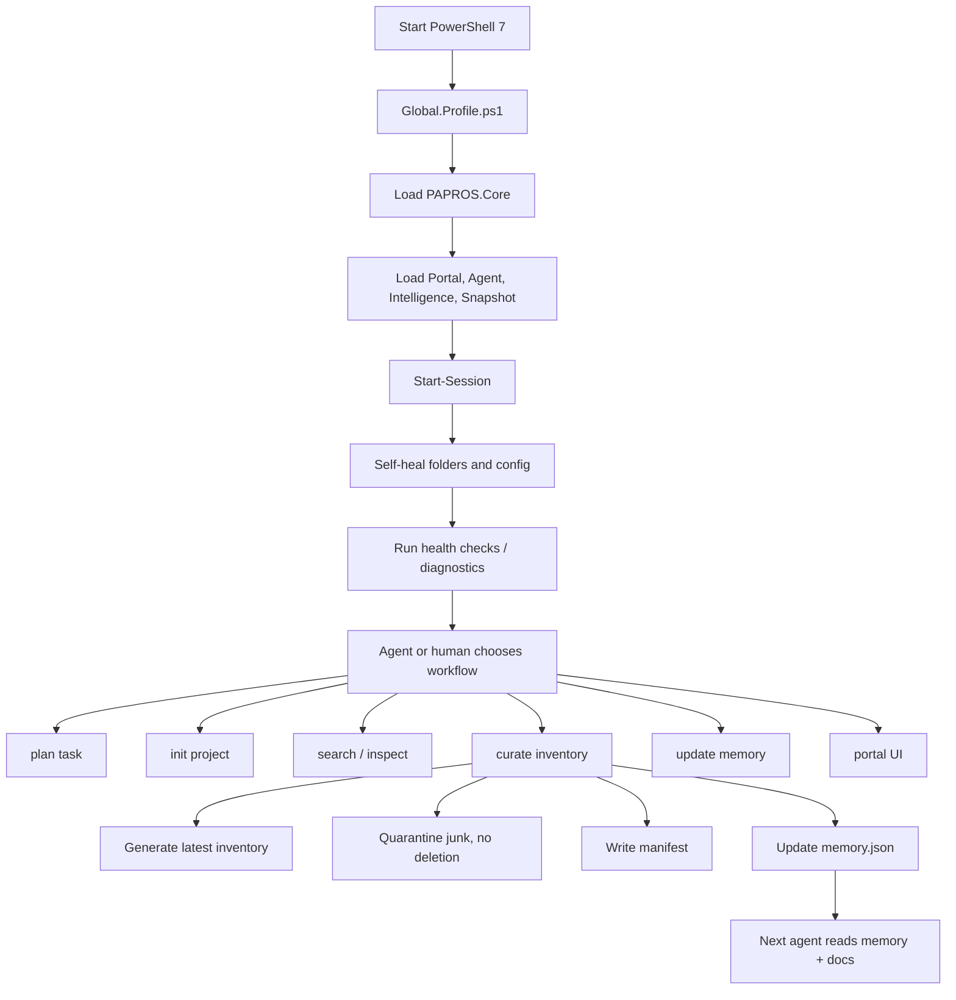
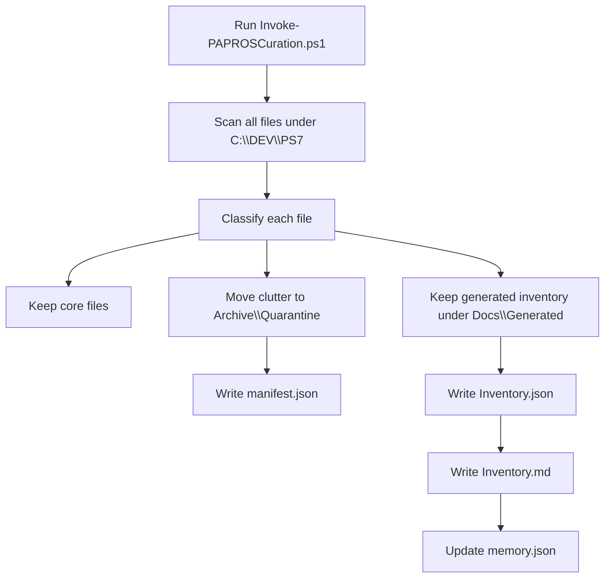

# PAPROS Project Overview

PAPROS is a personal PowerShell 7 agentic workstation rooted at `C:\DEV\PS7`.

Instead of keeping scattered scripts, profiles, prompts, notes, repair tools, and automation helpers across the machine, PAPROS turns them into one organized operating environment for both humans and AI agents. It gives agents a stable home base, rules, memory, logs, tools, docs, and workflows so they can work safely without getting lost or making unsafe changes.

## Core Idea

At the center is `PAPROS.Core`, which loads the environment, checks health, repairs missing folders, writes logs, and consolidates helper scripts.

Around it are the supporting modules and knowledge layers:

- `PAPROS.Portal`: interactive menu and UI layer
- `DotSources` (loaded by PAPROS.Core): skills, task helpers, project init, backup, deployment, and search
- `PAPROS.Intelligence`: memory and agent context
- `PAPROS.Snapshot`: inventory, snapshot, restore, and dashboard helpers
- `Docs`: human and cross-agent knowledge base
- `Data\Intelligence\memory.json`: compact machine-readable memory

## Startup Workflow

## Agent Workflow

Agents should begin with these files:

1. `AGENTS.md`
2. `Docs\CrossAgent\README.md`
3. `Docs\CrossAgent\Progress.md`
4. `Docs\KnowledgeBase\CanonicalRules.md`
5. `Docs\KnowledgeBase\AgentMemory.md`
6. `Data\Intelligence\memory.json`
7. `Docs\Generated\Curation\Inventory.md`

These files provide the rules, current state, latest inventory, known risks, and safe next actions.

## Cleanup And Reorganization Workflow

The cleanup system uses `Scripts\Invoke-PAPROSCuration.ps1`.

Nothing is permanently deleted. Suspicious or obsolete files are moved into quarantine with a restore manifest.

## Big Picture

PAPROS is becoming a local agent operating system for development work:

- It knows where it is.
- It knows what tools exist.
- It remembers important state.
- It documents itself for humans and agents.
- It quarantines instead of deleting.
- It prefers repeatable scripts over one-off manual cleanup.
- It gives Copilot, Claude, Codex, and Antigravity the same shared context.

In plain terms: PAPROS is your PowerShell command center plus an AI-safe workspace brain.
